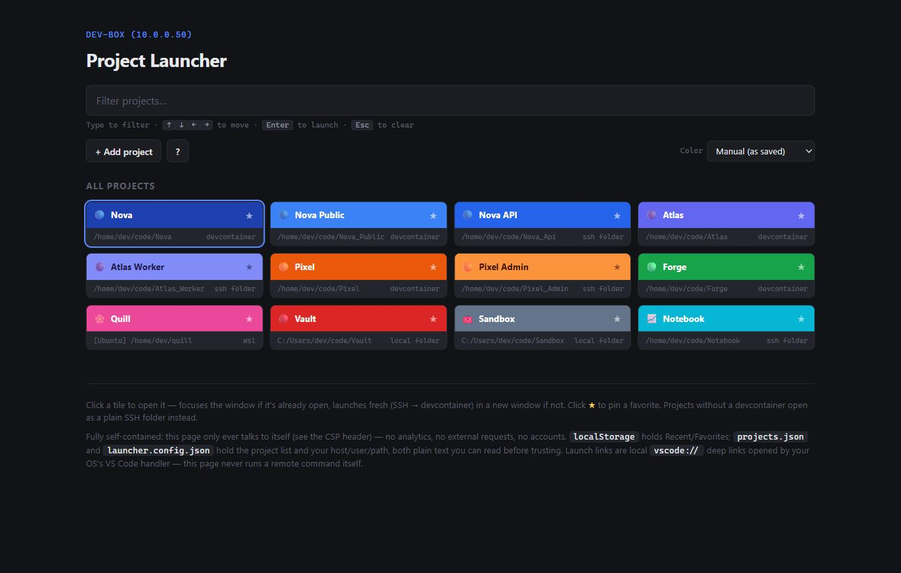
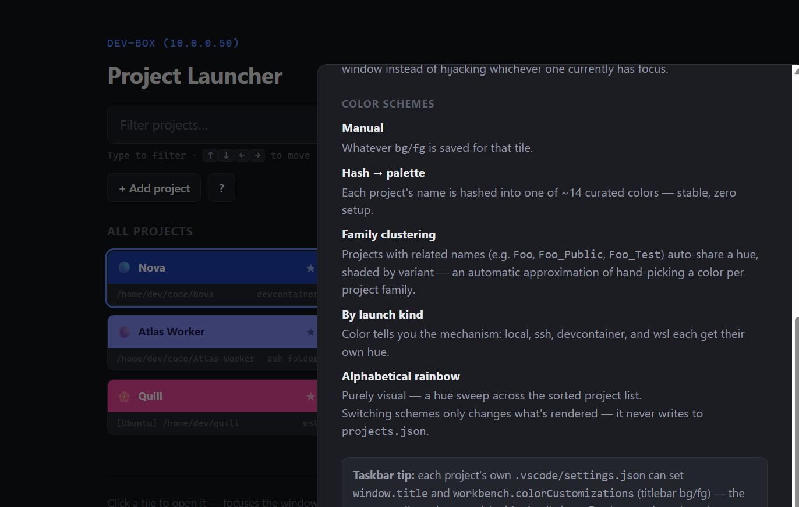

# Docking Bay

A keyboard-driven, colorful tile launcher for VS Code. Click (or type-and-`Enter`) a
tile and it opens that project in VS Code — local folder, SSH folder, an SSH
devcontainer, or WSL — always in its own fresh window, never hijacking whichever
window currently has focus.

It's a single static page. No build step, no backend, no account, no telemetry.
Everything it knows lives in two JSON files you can read in a text editor.



*(sample data shown — your own grid is whatever you put in `projects.json`)*

## Why

If you juggle a lot of projects across a lot of remote hosts and devcontainers,
`code --folder-uri` and VS Code's own "Open Recent" menu stop being fast past a
certain number of projects. This is a Rolodex for that: type a few letters, hit
Enter, you're in.

## Features

- **Keyboard-first** — autofocused search filters as you type; arrow keys move a
  grid-aware selection; `Enter` launches; `Esc` clears.
- **Four launch kinds** — local folder, plain SSH folder, SSH devcontainer, or WSL.
  Add any of them through the in-app form, no JSON editing required.
- **Always a fresh window** — every generated link carries `?windowId=_blank`, so
  clicking a tile never steals focus from — or replaces — whatever window you're
  already in.
- **Five color schemes**, switchable live from the toolbar: your own hand-picked
  colors, a deterministic hash-to-palette scheme, automatic "family" clustering by
  name (`Foo`, `Foo_Public`, `Foo_Test` share a hue), color-by-launch-kind, or a
  pure alphabetical rainbow. Purely a view — never rewrites your data file.
- **Installable PWA** — service worker + manifest, works offline once loaded, adds
  itself to your OS as a standalone app.
- **In-app help** — a `?` button opens a reference for shortcuts, launch kinds, and
  color schemes without leaving the page.

  
- **Self-contained and inspectable** — a strict Content-Security-Policy means the
  page literally cannot make an external request. Read `launcher.config.json` and
  `projects.json` yourself before trusting them; there's nothing else to trust.
- **Optional auto-detect** — a PowerShell script that SSHes into a configured host,
  scans for devcontainers, and merges what it finds into `projects.json` without
  clobbering anything you've hand-edited.

## Quick start

```powershell
# from the repo root
pwsh scripts/serve-launcher.ps1
```

This starts a tiny zero-dependency static server (pure PowerShell, no Node/Python
required) on `http://localhost:8420` and opens it in your default browser. It has
to be served over `http://` — browsers won't fetch local JSON files, or offer to
install a PWA, from a plain `file://` page.

Chrome/Edge will offer an "Install" icon in the address bar — worth doing, it turns
this into a real standalone app with its own window and taskbar icon.

## Adding a project

Click **+ Add project** and pick a kind:

| Kind | What it needs | Resulting link |
|---|---|---|
| Local folder | An absolute path on this machine | `vscode://file/<path>/` |
| SSH folder | A profile (see below) + remote path | `vscode://vscode-remote/ssh-remote+…` |
| SSH devcontainer | A profile + the folder's host path | `vscode://vscode-remote/dev-container+…` |
| WSL | Distro name + path inside it | `vscode://vscode-remote/wsl+<distro>/…` |

Projects added this way are saved to your browser's `localStorage` — they never
touch `projects.json` on disk, so there's nothing to accidentally commit.

## Configuration

**`launcher.config.json`** defines reusable SSH connection profiles:

```json
{
  "profiles": [
    { "id": "dev-box", "label": "dev-box (10.0.0.50)", "sshHost": "10.0.0.50", "sshUser": "me", "basePath": "/home/me/code" }
  ]
}
```

**`projects.json`** is the tile list. Each entry:

```json
{
  "p": "my-project",
  "t": "My Project",
  "e": "🔵",
  "bg": "#3B82F6",
  "fg": "#FFFFFF",
  "target": { "kind": "ssh-devcontainer", "profile": "dev-box", "hostPath": "/home/me/code/my-project", "workspaceFolder": "/workspace" }
}
```

Both files are fetched at load time — edit them by hand, or let the app and the
refresh script maintain them for you.

### Auto-detecting projects

```powershell
pwsh scripts/refresh-projects.ps1
```

For every profile in `launcher.config.json`, this SSHes in (using your existing SSH
key — nothing new is provisioned) and does a read-only scan of `basePath` for
`.devcontainer/devcontainer.json` files and any titlebar colors already set in each
project's `.vscode/settings.json`. It merges non-destructively: new folders get
added and flagged `_review` (pick an emoji), folders that disappeared get flagged
`_missing` rather than deleted, and it never overwrites an emoji or a manual
override you've already set.

## The taskbar trick

The tile color and emoji you see here are meant to travel with the project, not
just live in this launcher. Set the same emoji + color as a `window.title` and
`workbench.colorCustomizations` in a project's own `.vscode/settings.json`:

```json
{
  "window.title": "🔵 My Project",
  "workbench.colorCustomizations": {
    "titleBar.activeBackground": "#3B82F6",
    "titleBar.activeForeground": "#FFFFFF"
  }
}
```

Do that consistently and every open VS Code window carries its own emoji + color
into the Windows taskbar and Alt-Tab switcher — so once this launcher gets you into
five projects at once, telling them apart again is just as fast:

*(screenshot coming soon — a taskbar with several color-coded VS Code windows open)*

## How it stays safe to hand to a stranger

- `default-src 'self'` CSP — the page cannot fetch, post, or load anything
  off-origin, full stop.
- No `innerHTML` on anything data-derived — everything is built with
  `textContent`/`createElement`.
- The refresh script only ever runs one fixed, read-only remote command; folder
  names it discovers are treated strictly as data, never re-interpolated into a
  shell command.
- Nothing is sent anywhere. `localStorage` is the only state, and it never leaves
  your browser profile.

## Files

| File | Purpose |
|---|---|
| `project-launcher.html` / `project-launcher.js` | The app |
| `launcher.config.json` | SSH connection profiles |
| `projects.json` | The tile list |
| `launcher-manifest.webmanifest`, `launcher-icon.svg`, `launcher-sw.js` | PWA plumbing |
| `scripts/serve-launcher.ps1` | Zero-dependency local static server |
| `scripts/refresh-projects.ps1` | Optional SSH auto-detect / merge |
